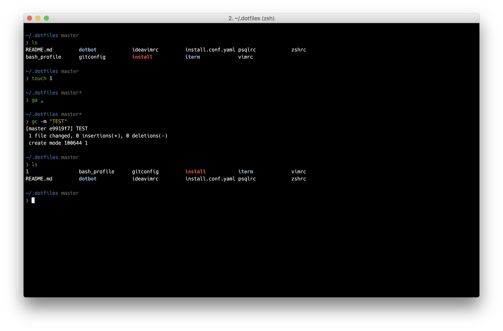
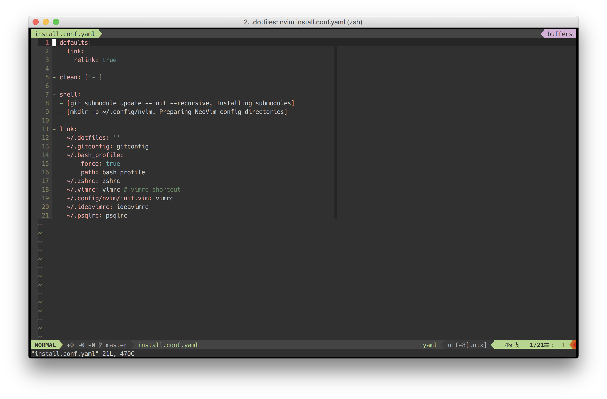

# Setup dotfiles For macOS

This envrionment bootstrapped by [dotbot](https://github.com/anishathalye/dotbot).

Prerequisites:
- [Hack Font](https://github.com/chrissimpkins/Hack)
- [HomeBrew](http://brew.sh)
    - [NeoVim](http://neovim.io)
    - [zsh](http://www.zsh.org/)

